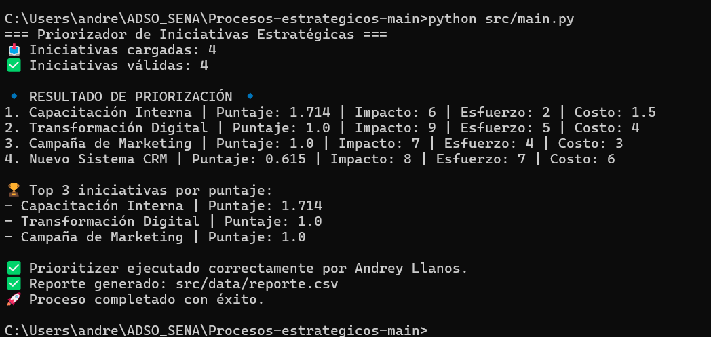

# 📌 Priorizador de Iniciativas Estratégicas  
## Categoría: Procesos Estratégicos

Proyecto desarrollado en equipo para la asignatura de Programación.  
El objetivo principal consiste en priorizar iniciativas estratégicas de una organización con base en criterios cuantificables.

### 👥 Integrantes y responsabilidades
- **María Fernanda Rojas** (Líder técnica)
- **Heidy Lizeth Vivas** 
- **Andrey Llanos**
- **Dayana Soriano Ruiz**
---

## 🎯 Problema / Necesidad

En muchas organizaciones la priorización de iniciativas se realiza con alto nivel de subjetividad. Esto genera:

- Asignación ineficiente de recursos
- Atrasos en logros estratégicos
- Falta de alineación con los objetivos institucionales

Se requiere un método **objetivo y sistematizado** que mejore la toma de decisiones respecto a qué implementar primero.

---

##  Solución Propuesta

Se desarrolló un **software en Python** que:

1. **Lee** un archivo CSV con iniciativas estratégicas
2. **Valida** que los datos cumplan criterios mínimos
3. **Calcula un puntaje de prioridad** dependiendo de:
   - Impacto
   - Esfuerzo
   - Costo
4. **Ordena** las iniciativas desde la más prioritaria
5. **Genera un archivo CSV** final llamado reporte.csv
6. Evidencia el proceso en consola  
📌 No se utilizó pandas, únicamente manejo de archivos nativo.

---

## 📂 Arquitectura del Proyecto

```
PROCESOS-ESTRATEGICOS/
│
├─ src/
│  ├─ main.py
│  ├─ modules/
│  │  ├─ data_loader.py
│  │  ├─ validator.py
│  │  ├─ prioritizer.py
│  │  └─ csv_report.py
│  └─ data/
│     ├─ bitacora.csv
│     ├─ iniciativas.csv
│     ├─ metricas.csv
│     ├─ reporte.csv (generado automáticamente)
│     └─ top_iniciativas.csv
│     
│
│
├─ tests/
├─ requirements.txt
├─ README.md
└─ .gitignore
```

---

##  Temas de Python aplicados

- Funciones
- Módulos e importaciones
- Listas y diccionarios
- Manejo de archivos CSV
- Manejo de excepciones
- Ordenamiento y filtrado de datos
- Simulación de arquitectura modular
- Pruebas unitarias

---

## 🛠 Requisitos Técnicos

| Recurso | Versión |
|--------|---------|
| Python | 3.13|
| SO     | Windows |
| Git    | Instalado |

 entorno virtual.

---

##  Manual de Usuario

### 1 Clonar repositorio  
```bash
git clone <URL-del-repositorio>
cd PROCESOS-ESTRATEGICOS
```

### 2 Crear entorno virtual (opcional, recomendado)
```bash
python -m venv venv
venv\Scripts\activate
```

### 3 Instalar dependencias
```bash
pip install -r requirements.txt
```

### 4 Ejecutar el programa
```bash
python src/main.py
```

### ✅ Archivo generado

Ruta:
```.
 src/data/reporte.csv          → Reporte general con todas las iniciativas
src/data/top_iniciativas.csv  → Top 3 iniciativas priorizadas
src/data/metricas.csv         → Métricas generadas (si aplica)
src/data/bitacora.csv         → Registro de ejecución

```

Columnas esperadas:
```
nombre  impacto  esfuerzo  costo  puntaje
```

Ejemplo de resultado:  
Iniciativas ordenadas desde la más prioritaria.

----

## 📸 Evidencias de Funcionamiento 

- 

----

##  Trabajo Colaborativo

Todos los integrantes realizaron **al menos 3 commits** significativos y **Pull Requests** revisados antes del merge en `main`.

| Integrante | Aporte | Evidencia |
|-----------|--------|-----------|
| María Fernanda | main.py, prioritizer.py, estructura, README | ✅ Commits y PR aprobados |
| Heidy | data_loader.py, data CSV, csv_report.py | ✅ Commits con validaciones |
| Dayana | mejoras, estructura prioritizer.py | ✅ Commits con validaciones |
| Andrey Llanos | Mejoras al `prioritizer.py`, cálculo del Top 3 e impresión personalizada | ✅ Commits con ejecución y reporte funcional |


Cada función del software se implementó en una rama distinta 
---

##  Mejoras Futuras

- Interfaz gráfica de usuario (GUI)
- Ajustes de modelos de priorización con más criterios
- Exportación adicional a  JSON
- Integración con bases de datos

---

